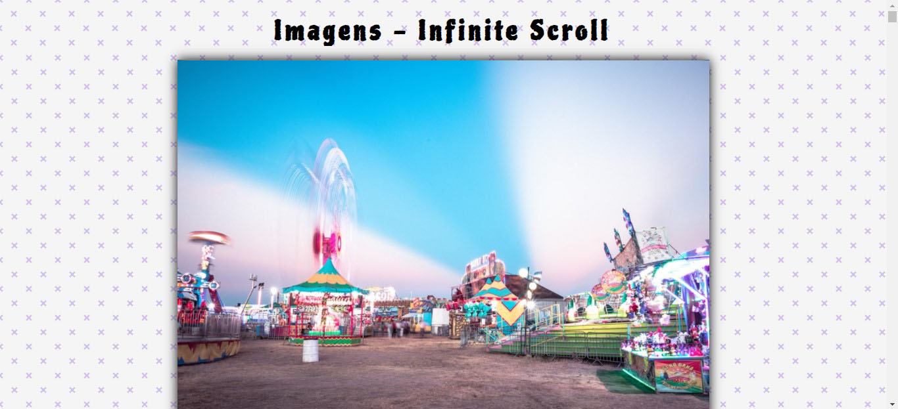

 

      

> Usa a API Unsplash p/ exibir imagens aleatórias em uma página de rolagem infinita.

<h4 align="center"> Veja funcionando <a href="https://imgs-infinite-scroll.web.app/" target="_blank">aqui</a>. </h4>

  

  

     
  

### Requisitos

- Cadastro na Unsplash (free)
